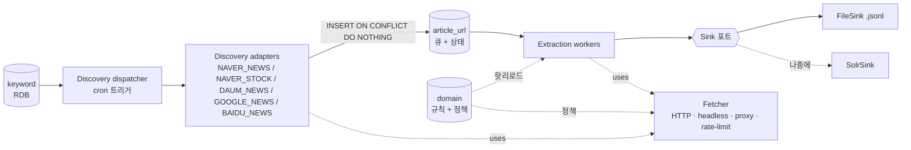
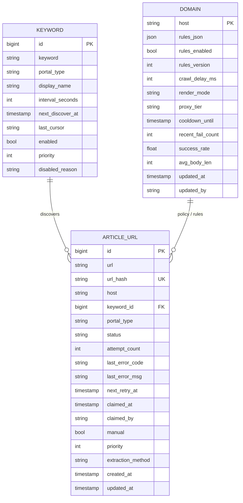
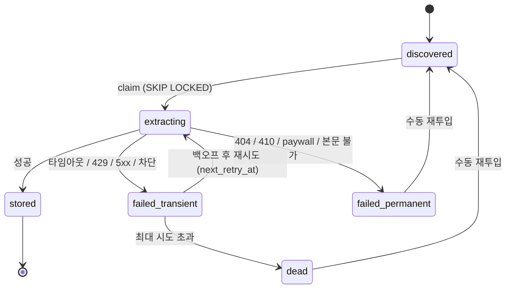

# keyword-collector — 설계 문서

> 이 문서는 구현 에이전트(Claude Code)가 읽고 개발에 착수하기 위한 설계 명세다.
> 결정 사항은 근거와 함께 기록했으며, 명세에서 벗어나야 할 경우 이 문서를 먼저 갱신한다.

---

## 1. 개요

키워드 기반으로 여러 포털·소스를 탐색해, 발견된 콘텐츠의 **URL·제목·본문·메타데이터**를 수집·저장하는 서비스다. 단발 스크립트가 아니라 운영(operation)을 전제로 한다.

- **대상 소스**: 네이버(뉴스·증권 종목토론), 다음 뉴스, 구글 뉴스, 바이두 뉴스 (`portal_type`: `NAVER_NEWS`, `NAVER_STOCK`, `DAUM_NEWS`, `GOOGLE_NEWS`, `BAIDU_NEWS`)
- **수집 단위**: 키워드. 키워드는 RDB에 저장되며 각 키워드는 `portal_type`을 가진다.  
  뉴스 포털은 검색어, 증권 종목토론은 종목코드 등이 키워드가 된다.
- **수집 대상의 핵심**: 본문 전문(full text). 이것이 빠지면 의미가 없다.
- **확장 방식**: 워커 컨테이너를 늘려 병렬 처리.

### 1.1 스크래핑 전용(API 미사용) 결정

본문 전문이 필수인데, 어떤 소스도 공식 API로 본문 전문을 제공하지 않는다(네이버 검색 API는 제목·요약·링크·날짜만, 다음/카카오는 뉴스 전용 검색 API 자체가 없음, 네이버 증권 종목토론·웨이보는 공개 API 미제공). 따라서 **모든 소스를 스크래핑으로 처리**한다. 발견(검색 결과 수집)도, 추출(본문 파싱)도 스크래핑이다. 그 결과 운영의 핵심 난제는 API 쿼터가 아니라 **안티봇 회피와 IP 관리**다.

---

## 2. 핵심 설계 원칙

1. **설정은 코드가 아니라 데이터로.** 추출 규칙, 도메인 정책, 수집 주기 등 운영 중 바뀌는 것들은 코드에 박지 않고 DB에 둔다. 재배포 없이 바꿀 수 있어야 한다.
2. **단계는 함수 호출이 아니라 영속 테이블로 분리한다.** 발견과 추출은 서로를 호출하지 않고, RDB의 작업 테이블(`article_url`)을 통해서만 소통한다. 이 테이블이 두 단계의 인터페이스다.
3. **경계는 포트(인터페이스)로 둔다.** Sink(저장소), Fetcher(네트워크), Extractor(추출), SourceAdapter(소스)는 모두 교체 가능한 인터페이스로 정의한다. 예: 저장소를 File→Solr로, 프록시 공급자를 단일 IP→로테이팅으로 교체해도 다른 코드는 손대지 않는다.
4. **실패를 일급으로 다룬다.** 차단을 "막는다"가 아니라 "맞아도 우아하게 물러났다 다시 온다"로 설계한다.
5. **테이블은 과하게 분리하지 않는다.** 상태·실패·재시도는 별도 테이블이 아니라 작업 테이블의 컬럼으로 흡수한다.

---

## 3. 아키텍처 개요



### 3.1 2단계 파이프라인

- **발견(Discovery)**: 입력 `(keyword, portal_type)` → 출력은 콘텐츠 URL을 `article_url`에 `status=discovered`로 적재. 소스별 어댑터가 검색·목록 페이지를 스크래핑한다. 본문은 건드리지 않는다.
- **추출(Extraction)**: `article_url`에서 작업을 점유 → 콘텐츠 페이지를 가져와 제목·본문·메타를 파싱 → 성공 시 Sink에 기록하고 `status=stored`.

두 단계를 분리하는 이유: ① 발견 실패와 추출 실패가 서로 다른 재시도 단위로 격리된다, ② 발견이 적재한 URL은 일부 추출이 실패해도 손실되지 않는다, ③ 수동 재스크랩이 별도 파이프라인 없이 상태 변경만으로 가능해진다.

---

## 4. 모듈 구조

패키지는 책임별로 나눈다(아래는 권장 구조이며 언어는 Python).

```
app/
  adapters/            # SourceAdapter 구현: naver_news.py, naver_stock.py, daum_news.py, google_news.py, baidu_news.py
  extraction/          # 추출 체인: library_chain.py, rule_engine.py, extractor.py
  fetch/               # Fetcher: http_client.py, headless.py, proxy.py, rate_limit.py
  sink/                # Sink 포트 + 구현: base.py, file_sink.py, solr_sink.py(나중)
  repository/          # RDB 접근: keyword_repo.py, article_url_repo.py, domain_repo.py
  scheduling/          # discovery dispatcher, overlap lock
  worker/              # extraction worker 루프, reaper
  domain_logic/        # URL 정규화, 실패 분류, 백오프 계산
  admin/               # 관리 API/UI (규칙 편집·테스트·재투입·run-now·모니터링)
  config.py            # 환경변수/설정파일 로딩
```

### 4.1 핵심 포트(인터페이스)

```python
class SourceAdapter(Protocol):
    portal_type: str
    def discover(self, keyword: str, cursor: str | None) -> DiscoverResult:
        """검색·목록 결과를 긁어 콘텐츠 URL 목록과 다음 cursor를 반환. 본문은 다루지 않음."""

class Fetcher(Protocol):
    def fetch(self, url: str, *, render: str = "static") -> FetchResult:
        """static(HTTP) 우선, render='headless'면 브라우저. 프록시·레이트리밋·네트워크 재시도는 내부 처리."""

class Extractor(Protocol):
    def extract(self, url: str, html: str, host: str) -> Article | ExtractionFailure:
        """규칙 존재 시 규칙 우선, 없으면 라이브러리 체인. 소스·콘텐츠 타입 무관. 실패 판정 포함."""

class Sink(Protocol):
    def write(self, article: Article) -> None:
        """현재 FileSink(.jsonl), 나중에 SolrSink. 콘텐츠 타입 무관, 호출부는 동일."""
```

### 4.2 실행 모델 — 역할·포털별 독립 실행

코드는 한 벌이고, **같은 이미지를 실행 인자(또는 환경변수)만 바꿔** 여러 컨테이너로 띄운다. 인자는 두 축이다.

- `--role` : `discovery` | `extraction` — **진입점 선택**(어느 루프를 돌릴지).
- `--portal` : `naver_news` | `naver_stock` | `daum_news` | `google_news` | `baidu_news` | `all` — **점유 쿼리의 `WHERE portal_type` 필터값**. 기본값 `all`.

```bash
python -m app --role discovery  --portal naver_news   # 네이버 발견자
python -m app --role discovery  --portal daum_news    # 다음 발견자
python -m app --role extraction --portal all     # 공용 추출자
```

```yaml
# 같은 이미지, 인자만 다르게
services:
  discover-naver_news: { image: keyword-collector:latest, command: ["--role","discovery","--portal","naver_news"] }
  discover-daum_news:  { image: keyword-collector:latest, command: ["--role","discovery","--portal","daum_news"] }
  extract:        { image: keyword-collector:latest, command: ["--role","extraction","--portal","all"], deploy: { replicas: 3 } }
```

핵심 규칙: **인자는 진입점에서만 분기하고 그 아래 로직은 동일**해야 한다. `--role`은 루프 선택, `--portal`은 필터값일 뿐이다. 어댑터 선택은 발견자가 집은 키워드의 `portal_type`으로 결정되므로, 포털별 별도 코드 경로를 만들지 않는다(같은 코드에 필터만 다르게 먹인다). CLI 인자와 환경변수를 모두 받고 CLI가 환경변수를 덮어쓰게 하면 가장 유연하다(K8s에서는 환경변수 주입이 편하다).

**권장 형태**: 발견은 포털별로 분리(스크래핑 대상·차단 양상·렌더링 방식이 포털마다 다름), 추출은 공용(추출할 URL의 도메인이 포털과 무관한 경우가 많음). 확장도 병목만 독립적으로 — 네이버 키워드가 많으면 `discover-naver_news`만 replicas를 늘리고(같은 포털 발견자 여러 개는 `SKIP LOCKED`로 키워드를 안 겹치게 나눠 가짐), 추출이 밀리면 `extract`만 늘린다. 소규모일 땐 `--portal all` 발견자 하나로 시작해 트래픽이 커지면 포털별로 무중단 분리.

**전제**: 프로세스는 독립이지만 **MySQL과 `article_url` 큐는 공유**한다(데이터 평면은 하나). 포털별로 물리적으로 다른 DB를 쓰는 분리는 이 설계 범위 밖이다.

---

## 5. 데이터 모델

### 5.1 RDB 테이블 (3개로 통합)



**`keyword`** — 작업 원천이자 스케줄 상태. 기존 테이블에 스케줄 컬럼만 확장한다. `interval_seconds`/`next_discover_at`은 지금(하루 1회, cron)에서는 안 써도 두기만 하면 미래에 "키워드별 주기"로 전환할 때 스키마 변경이 없다.

**`article_url`** — 시스템의 심장. 작업 큐 + 상태 기계 + 실패 보관소를 한 테이블로 통합했다. "실패 URL을 따로 보관"하는 요구는 별도 테이블이 아니라 `status` 값으로 흡수된다.
- `url_hash`에 **UNIQUE 제약** (중복 방지의 관문 — 6절 참고).
- `status` enum: `discovered`, `extracting`, `stored`, `failed_transient`, `failed_permanent`, `dead`. (`stored`는 성공 종료. 나중에 Solr를 붙이면 의미상 "indexed"에 해당.)
- 인덱스: `url_hash`(unique), `(status, next_retry_at, priority)`(점유 쿼리용), `host`, `keyword_id`.

**`domain`** — 도메인별 **예외만** 담는 희소(sparse) 테이블. 추출 규칙 + 수집 정책 + 차단기 상태 + 건강 지표를 한 행에 모았다. **모든 도메인이 행을 갖지 않는다.** 규칙/정책 오버라이드가 필요한 도메인만 행이 있고 나머지는 전부 기본값으로 동작한다.
- `render_mode`: `static` | `headless`.
- `success_rate`/`avg_body_len`: 드리프트 감지용(11.4절).

**선택적 4번째 테이블** — 규칙 롤백 이력이 중요하면 가벼운 `domain_rule_history(host, rules_json, version, created_at, created_by)`를 추가한다. 과하면 생략하고 `domain` 행에 직전 규칙을 JSON 한 벌로 보관해도 된다. 운영 중 규칙 수정 빈도를 보고 결정.

### 5.2 파일 출력 형식 (초기 Sink)

- **결과 데이터**: JSON Lines(`.jsonl`), append 친화적이고 나중에 Solr bulk import에 그대로 쓸 수 있다.
- **파티셔닝**: `data/{YYYY-MM-DD}/{portal_type}.jsonl` — 날짜·소스별로 나눠 관리·재적재를 조각 단위로.
- **운영 로그**: 수집 진행·하트비트·에러는 콘텐츠 데이터와 섞지 않고 별도 로그로 분리한다. 정보 로그와 **전용 에러 로그**를 또 나눈다 — 상세는 12절.
- Article 레코드 필드(예): `url`, `url_hash`, `portal_type`, `keyword`, `title`, `body`, `published_at`, `author`, `collected_at`, `extraction_method`, `body_len`.

---

## 6. 중복 방지 (다른 키워드라도 같은 URL)

중복 제거는 **Sink가 아니라 RDB에서** 한다. 파일은 유니크를 강제할 수 없으므로, `article_url.url_hash` UNIQUE 제약이 유일한 관문이다.

- 발견 단계에서 URL을 찾으면 어느 키워드에서 왔든 `INSERT ... ON DUPLICATE KEY UPDATE`(또는 `INSERT IGNORE`)로 `url_hash` UNIQUE 키 기준 중복을 흡수한다.
- 새로 들어가면 추출 대상이 되고, 이미 있으면(다른 키워드가 먼저 넣었거나 과거에 넣었거나) 조용히 무시된다.
- 결과: **하나의 콘텐츠는 한 번만 추출되고 Sink에 한 번만 기록된다.** Sink가 파일이든 Solr든 동일하게 동작한다.

**URL 정규화 필수.** 해시 전에 정규화하지 않으면 같은 콘텐츠가 다른 URL로 보여 중복 제거가 안 먹는다. 정규화 규칙:
- 추적 파라미터 제거(`utm_*`, `fbclid` 등 화이트리스트 기반),
- 스킴/호스트 통일(http→https, 호스트 소문자, `www.` 처리 정책),
- 끝 슬래시·기본 포트·프래그먼트(`#...`) 제거,
- (가능하면) 모바일/데스크톱 주소 통일.
정규화된 URL로 `url_hash`(예: sha256)를 만든다.

> "이 URL을 어떤 키워드들이 매칭했는지"까지 추적하려면 conflict 시 `keyword_id`를 JSON 배열에 덧붙이는 옵션을 둘 수 있다. 중복 방지 자체에는 불필요.

---

## 7. 스케줄링 (cron 트리거)

현재 요구: **하루 1회 수집**, cron 사용. 단, cron은 "무엇을 수집할지"를 박지 않고 **트리거(틱)로만** 쓴다.

- cron이 하루 1회 발견 디스패처를 깨운다.
- 디스패처는 DB에서 `enabled` 키워드를 (추출과 동일하게 `FOR UPDATE SKIP LOCKED`로) 점유해 발견을 돌린다.
- 이 구조 덕분에 나중에 "이 키워드만 3시간마다"가 필요해지면 cron을 더 자주(예: 매시) 돌리고 디스패처가 `next_discover_at <= now`인 것만 집어가게 바꾸면 끝이다. 스키마·구조 변경 없음.

**cron의 치명적 단점 대비 — 실행 겹침 방지.** 수집이 다음 cron 틱을 넘기면 두 실행이 부딪힌다. 시작 시 잠금(`flock` 또는 DB 실행 락 행)을 잡아 **이전 실행이 안 끝났으면 이번 틱은 건너뛴다.** (cron 호스트 다운으로 그날 실행이 누락되는 것은 하루 주기에서는 감수.)

---

## 8. 발견 전략 (소스별)

> **이 절의 전략값(기간 필터 단위·정렬·중단 조건)은 유동적이다** — 고객 요청에 따라 바뀔 수 있다(13.1). 따라서 모두 발견 어댑터 내부와 설정값으로 격리하고, 추출·저장·실패 처리는 이에 의존하지 않는다.

발견의 목표는 "검색 결과에서 새 콘텐츠 URL만 추려 큐에 넣기"다. 핵심 난제는 **어디까지 긁고 멈출 것인가**이며, 이는 소스가 제공하는 정렬·기간 필터 기능에 따라 갈린다.

### 8.1 정밀 경계는 코드가, 거친 경계는 필터가

포털의 기간 필터는 보통 띄엄띄엄한 단위(1일 / 1주 / 1개월)뿐이라 "지난 36시간" 같은 정확한 경계를 표현할 수 없다. 그래서 역할을 나눈다.

- **기간 필터 = 넉넉한 하한.** 누락이 안 생기게 한 단계 넉넉히 고른다(어제치가 확실히 포함되도록, 필요하면 "1일" 대신 "1주"). 과수집분은 아래 두 장치가 받아낸다.
- **정밀 경계 = `collection_log` 기반 컷오프.** 매 실행은 "마지막 성공 수집 시각 이후"를 목표로 하고, 약간의 안전 겹침을 둬서 그보다 조금 이전부터 가져온다. 마지막 성공 시각은 `collection_log`에서 `MAX(started_at) WHERE keyword_id=? AND error_msg IS NULL`로 조회한다. 실행이 하루·이틀 밀려도 컷오프 기준으로 따라잡으므로 "1일 필터가 없어서 생기는 누락"이 사라진다.
- **최종 방어 = `url_hash` 중복 제거.** 겹쳐 들어온 과거 글은 6절 메커니즘으로 조용히 버려진다.

### 8.2 정렬 신뢰 가능 여부로 중단 전략이 갈린다

**증분 중단**("이미 본 URL을 만나면 그 뒤는 다 오래된 것이니 멈춤")은 결과가 **최신순 정렬**일 때만 성립한다. 요즘 포털 검색은 기본이 정확도순이라 신·구 콘텐츠가 섞여 나올 수 있어, 정렬을 신뢰할 수 없으면 증분 중단은 새 콘텐츠를 놓치게 한다. 그래서 두 경로로 나눈다.

- **정렬 신뢰 가능(최신순 강제 가능)**: 기간 필터 + 최신순 + **증분 중단**(이미 본 url_hash 또는 컷오프보다 오래된 콘텐츠를 만나면 그 지점에서 페이징/스크롤 종료). 값싸게 끝난다.
- **정렬 신뢰 불가(정확도순뿐)**: 기간 필터로 **결과 집합을 한정**한 뒤, 정렬을 믿지 않고 그 유한 집합을 끝까지 훑으며 콘텐츠마다 날짜로 판정해 컷오프보다 새것만 담는다. 멈춤 기준은 "헌 콘텐츠를 만나서"가 아니라 "필터로 좁혀진 결과를 다 봤거나 페이지/스크롤 상한 도달". 집합이 작으니 끝까지 봐도 부담이 적다.

### 8.3 소스별 전략표

| 소스 | 기간 필터 | 최신순 정렬 | 중단 전략 | render_mode | 비고 |
|---|---|---|---|---|---|
| 네이버 | 1일·1주 | 가능 | 증분 중단(정렬 신뢰) | static 우선 | 검색 결과가 무한 스크롤 → 9.5 |
| 다음 | 1일·1주 | 가능 | 증분 중단(정렬 신뢰) | static 우선 | SHOW_DNS=0 쿠키로 전체 언론사 수집. 제휴사(v.daum.net/v/) + 비제휴사(cp.news.search.daum.net/p/) 두 URL 패턴 처리 |
| 구글 | 1일·1주(`tbs=qdr:d` 등) | **없음** | 집합 한정 + 날짜 판정 + 상한 | **headless** | 안티봇 가장 공격적, 보수적 속도 |
| 바이두 | 분석 필요 | 분석 필요 | 분석 후 결정 | headless 가능성 높음 | 9.4 |

기간 필터 파라미터(예: 구글 `tbs=qdr:d`)는 비공식이라 바뀔 수 있으므로 **코드에 하드코딩하지 말고 설정값으로** 둔다. 필터가 깨지거나 무시되어도 폭주하지 않도록, 필터는 최적화 수단으로만 쓰고 페이지/스크롤 상한과 컷오프 판정을 항상 보험으로 깔아둔다.

### 8.4 바이두 뉴스 (미확정)

바이두 뉴스는 중국 검색 포털로 별도 분석이 필요하다. 확인 항목: ① 기간 필터 지원 여부·단위, ② 최신순 정렬 가능 여부, ③ 해외 접속 차단 여부 및 프록시 필요성(중국 IP 필요 가능성 높음), ④ headless 필요 여부. ①·② 결과에 따라 네이버형(증분 중단) 또는 구글형(집합 한정)으로 떨어진다.

### 8.5 무한 스크롤 처리 (네이버 등)

검색 결과가 페이지네이션이 아니라 무한 스크롤인 경우:

1. **내부 요청 직접 호출을 먼저 시도.** 무한 스크롤은 대개 뒤에서 "다음 N개" API(보통 JSON)를 호출한다. 브라우저 개발자도구 Network 탭에서 그 요청의 URL·파라미터(오프셋/start)·응답 형태를 확인해, 호출 가능하면 headless 없이 정적 HTTP로 페이지네이션처럼 다룬다(오프셋 값이 `last_cursor`가 된다). 가장 가볍고 차단 위험도 낮다.
2. **막히면 headless 스크롤로 폴백.** 토큰·서명·쿠키로 내부 요청이 거부되면 headless로 스크롤한다. 단 무작정 끝까지가 아니라 9.1~9.2의 중단 조건(기간 필터·컷오프·상한)을 그대로 적용한다. 스크롤 후에는 고정 sleep 대신 "새 항목이 나타날 때까지 대기"하고, 한 세션 내 중복은 url_hash가 최종적으로 잡는다.

---

## 9. 추출 전략 (라이브러리 우선, 규칙 보정)

수집된 URL 의 HTML이 제각각이라 초반에는 라이브러리가 대부분을 처리하고, 규칙은 실패가 잦은 소수 도메인에만 쌓인다.

체인 순서:
1. **도메인에 활성 규칙이 있으면 규칙 우선.** 규칙을 등록했다는 건 라이브러리가 못 미더운 도메인이라는 뜻이므로 라이브러리를 먼저 돌리면 "틀린 본문"을 통과시킬 위험이 있다.
2. 규칙이 없는(처음 보는) 도메인은 **라이브러리 체인**: 1차 추출기 → 실패 시 2차 추출기.
3. 둘 다 실패하면 추출 실패로 분류(10절).

**성공/실패 판정 기준**(폴백 트리거): 본문 길이가 임계값(예: 200자) 미만이거나 제목이 비면 실패로 보고 다음 전략으로.

### 9.1 규칙 = 데이터 (재배포 없는 핫리로드)

규칙은 코드가 아니라 `domain.rules_json`에 선언적으로 둔다. `type`은 앱에 미리 구현된 고정 엔진(`css`/`xpath`/`regex`)만 가리킨다 — 임의 코드 실행이 아니다. 후처리(`exclude`/`parse` 등)도 화이트리스트로 제한.

```json
{
  "title":        { "type": "css", "expr": "h2.headline", "attr": "text" },
  "body":         { "type": "css", "expr": "#article-body", "attr": "text", "exclude": [".ad", ".reporter"] },
  "published_at": { "type": "css", "expr": "span.date", "attr": "data-time", "parse": "datetime" },
  "press":        { "type": "css", "expr": "img.logo", "attr": "alt" }
}
```

**핫리로드 메커니즘**: 워커가 규칙을 메모리에 캐시하되 짧은 TTL(예: 60초)을 둔다. TTL 경과 시 `domain`에서 다시 읽는다. 관리자가 규칙을 고치면 길어야 1분 안에 모든 워커가 새 규칙을 쓴다 — 배포·재시작 없음. (더 즉각적이어야 하면 전역 `rules_version` 카운터를 두고 버전 변동 시에만 리로드.)

---

## 10. 실패 전략 (핵심)

### 10.1 URL 상태 기계



### 10.2 실패 분류

| 분류 | 예시 에러 | 처리 |
|---|---|---|
| 일시(transient) | 타임아웃, 연결 끊김, 429, 502/503/504, 차단 감지 | `attempt_count++`, `next_retry_at` = 지수 백오프 + 지터, 재점유 대기 |
| 영구(permanent) | 404, 410, 하드 403, paywall, 모든 전략으로도 본문 불가 | 자동 재시도 안 함. 검토/수동 재투입 대상 |
| dead | 일시 실패가 최대 시도 초과 | 자동 재시도에서 제외, 검토 목록에 노출 |

### 10.3 6겹 안전장치

1. **Fetcher 내부 네트워크 재시도** — 짧은 일시 오류(커넥션 블립)용, 소수 회.
2. **URL 상태 기계** — 분류 + 지수 백오프(+지터) `next_retry_at`.
3. **도메인 차단기** — 한 도메인에서 429가 연달면 `domain.cooldown_until`을 세워 그 도메인 전체를 잠시 쉰다(개별 URL 백오프와 별개).
4. **점유 회수기(reaper)** — `status=extracting`인데 `claimed_at`이 타임아웃을 넘긴 row(워커 크래시 추정)를 주기적으로 `discovered`로 되돌린다.
5. **dead-letter** — 최대 시도 초과 시 `dead`로 격리.
6. **수동 재투입** — 운영자 주도(10.4).

### 10.4 수동 재스크랩

큐가 상태 컬럼을 가진 테이블이므로 별도 수동 파이프라인이 필요 없다.
- 관리 UI에서 실패 URL을 필터(소스·도메인·에러·기간)로 골라 "재투입" → `status=discovered`, `next_retry_at=now`, 필요 시 `attempt_count=0`, `manual=true`.
- 평소 추출 워커가 동일한 점유 로직으로 집어간다.
- **규칙 핫리로드와의 시너지**: 특정 도메인 때문에 실패가 쌓였을 때, 관리 UI에서 그 도메인 규칙을 등록(즉시 반영)하고 실패 URL을 재투입하면 워커가 새 규칙으로 다시 긁는다.
- 재투입에 **우선순위 레인**(`priority`)을 주면 평소 백로그에 안 밀린다.
- 멱등성: 같은 URL을 다시 처리해도 Sink가 Solr면 `url_hash` 문서 id로 upsert되어 안전.

---

## 11. 페치 / 안티봇

### 11.1 공용 Fetcher와 IP 분리

모든 워커의 네트워크 요청은 공용 Fetcher를 통해서만 나간다. 안티봇 로직(프록시·레이트리밋·헤드리스 폴백)이 한 곳에만 산다.

**핵심: 출구 IP를 컨테이너 수에서 분리한다.** "컨테이너 1개당 IP 1개"로 묶지 말고, 모든 요청을 **공용 프록시 레이어**로 흘리고 IP 회전은 거기서 일어나게 한다. 컨테이너는 파싱 처리량을 위해 늘리고, IP 다양성은 프록시 풀이 책임진다. 프록시는 **공급자 교체 가능한 인터페이스**로 두고(단일 IP도 그 인터페이스의 한 구현), 공급자 결정은 나중에 해도 코드 재작업이 없게 한다. (현재 프록시 환경 미정 — 13.1 참고.)

### 11.2 예의(politeness) — 공짜이자 1차 방어

- 도메인별 요청 속도 제한(`domain.crawl_delay_ms`),
- 사람처럼 보이는 무작위 지연,
- 실제 브라우저 같은 User-Agent·헤더, 세션 재사용,
- **한 도메인 세션 동안은 IP·UA를 유지**(매 요청 무작정 바꾸면 그게 봇 신호). IP와 헤더는 한 묶음으로 회전.
- 429/403 수신 → 해당 도메인 백오프(10.3-3) 신호로 사용.

### 11.3 수집 방식 — 정적 우선, 헤드리스 폴백

기본은 정적 HTTP(빠르고 가벼움), 막히는 소스만 헤드리스(Playwright, 무겁지만 강함). 소스별 기본값은 `domain.render_mode`로 제어.
- 네이버·다음: 정적 우선.
- **바이두·구글: 헤드리스 가능성 높음.** 특히 **구글이 넷 중 안티봇이 가장 공격적**이다(캡차·차단이 빠름). 구글 도메인은 `render_mode=headless` + 긴 `crawl_delay_ms` + 보수적 속도로 시작할 것. 바이두는 중국 외 IP 차단 가능성이 있으므로 중국 프록시 필요 여부를 먼저 확인한다.

### 11.4 드리프트 감지 루프

글마다 `extraction_method`와 본문 길이를 기록하고, `domain`의 `success_rate`·`avg_body_len`을 갱신한다. 특정 도메인의 성공률/평균 본문 길이가 급락하면 알림 → "이 도메인 규칙을 손볼 때"라는 신호 → 관리 UI에서 규칙 수정 → 핫리로드로 자동 반영. 루프가 닫힌다.

---

## 12. 관측성 / 로깅

워커(발견자·추출자)가 멈추거나 죽었을 때 **왜 멈췄는지를 로그만 보고 알 수 있어야** 한다. 이를 위해 두 종류의 실패를 명확히 분리한다.

- **항목(item) 단위 실패** — 개별 URL/키워드의 실패는 DB(`article_url.status`·`last_error_*`)에 기록한다(10절). 한 항목이 실패해도 워커는 다음 항목으로 계속 간다.
- **프로세스(worker) 단위 멈춤** — 워커 루프나 프로세스 자체가 멈추거나 죽는 것은 DB가 아니라 **로그로 진단**한다. 이 절의 초점이다.

### 12.1 로그 스트림 분리

- `app.log` (정보 로그): 정상 동작·진행·하트비트. 시끄러워도 된다.
- **`error.log` (전용 에러 로그)**: WARNING/ERROR 이상만 쌓는다. **멈춤 원인을 한 곳에서** 본다 — 단순함이 목적이다. "왜 멈췄나"는 `error.log`의 마지막 줄만 보면 되도록 설계한다.
- (선택) 더 단순하게 보고 싶으면 컴포넌트별로 `discovery.error.log` / `extraction.error.log`로 나눠도 된다. 기본은 공용 `error.log` + 엔트리의 `component` 필드로 구분.
- 정보 로그와 에러 로그는 **같은 에러를 양쪽에 모두** 남겨도 된다(정보 로그엔 맥락 흐름, 에러 로그엔 진단). 핵심은 에러 로그가 에러만으로 자급자족하는 것.

### 12.2 에러 엔트리 포맷 (자급자족)

한 줄에 진단에 필요한 컨텍스트를 다 담아, 다른 로그와 교차 참조 없이 원인을 알 수 있게 한다.

```
{ts} {level} {component} worker={worker_id} phase={phase} keyword_id={id} url_id={id} host={host} code={error_code} {message}
<여러 줄 traceback 블록>
```

예:
```
2026-05-30T09:14:02Z ERROR extraction worker=ex-3 phase=fetch keyword_id=- url_id=42 host=news.example.com code=TIMEOUT httpx.ReadTimeout: read timed out
Traceback (most recent call last):
  ...
```

- `component`: `discovery` | `extraction` (그 외 `dispatcher`/`reaper` 등).
- `phase`: 어디서 터졌는지(`startup`/`claim`/`fetch`/`parse`/`sink`/`shutdown`).
- `worker_id`: **어느 워커가** 멈췄는지 즉시 식별.

### 12.3 멈춤(halt) 종류별 필수 로깅

워커 루프 최상단에 포괄 예외 처리를 두고, 아래 세 경우를 반드시 남긴 뒤 종료한다. **조용히 죽지 않게** 하는 것이 원칙이다.

1. **미처리 예외로 죽을 때** — traceback을 `error.log`에 남기고(레벨 ERROR, `phase=...` 포함) 죽는다.
2. **시작 실패**(DB 연결 불가, 설정 누락, 마이그레이션 미적용 등) — 원인을 `error.log`에 남기고(`phase=startup`) 비정상 종료 코드로 exit.
3. **정상/시그널 종료**(SIGTERM 등) — `phase=shutdown reason=signal`처럼 종료 사유를 남긴다.

→ 결과적으로 **`error.log`의 마지막 줄이 곧 그 워커가 멈춘 이유**가 된다.

항목 단위 실패와 프로세스 치명 오류를 레벨로 구분한다: 항목 실패는 분류(10.2) 후 DB 기록 + 정보 로그(WARNING 이하)로, 루프 자체를 끝내는 치명 오류만 ERROR + `error.log`로. 한 항목의 실패가 워커 전체를 죽이지 않도록 항목 처리는 `catch → 분류 → DB 기록 → 다음 항목`으로 감싼다.

### 12.4 생존 신호(하트비트)

각 워커는 주기적으로(예: `HEARTBEAT_INTERVAL_SECONDS`) 진행 카운터(처리/성공/실패 수, 마지막 항목)를 정보 로그에 남긴다. 워커가 "멈춘 듯" 보일 때, **정보 로그의 마지막 하트비트 + `error.log`의 마지막 에러**를 함께 보면 "언제까지 살아 있었고 무엇 때문에 멈췄나"가 드러난다. (DB 쪽에서는 `claimed_at`이 멈춘 row를 reaper가 회수하므로(10.3-4), 로그는 원인 진단, DB는 복구를 담당한다.)

### 12.5 운영 편의

- **로그 로테이션**(크기 또는 일자 기준)으로 `error.log`가 무한정 커지지 않게 한다.
- 한 수집 사이클을 묶어 보려면 상관 ID(`run_id`/`cycle_id`)를 엔트리에 포함(선택).

---

## 13. 기술 스택 / 의존성 (권장)

- **언어**: Python.
- **정적 HTTP**: `httpx`(또는 `requests`).
- **헤드리스**: `playwright`.
- **본문 추출 라이브러리 체인**: 1차 `trafilatura`, 2차 보조(`readability-lxml`/`newspaper` 등 중 택1).
- **규칙 기반 파싱**: `lxml`/`selectolax`/`BeautifulSoup`.
- **RDB**: **MySQL 8.0 이상**(확정). `FOR UPDATE ... SKIP LOCKED`는 MySQL 8.0+에서만 지원되므로 이 버전이 전제다. 접근은 `SQLAlchemy`.
  - **문자셋**: 테이블·컬럼·커넥션을 모두 `utf8mb4`로 통일한다. 바이두 중문과 한국어를 함께 다루므로, 이게 누락되면 저장 단계에서 문자가 깨진다.
  - **중복 삽입 구문**: PostgreSQL의 `ON CONFLICT DO NOTHING`에 해당하는 MySQL 구문은 `INSERT ... ON DUPLICATE KEY UPDATE`(또는 `INSERT IGNORE`)다. `url_hash` UNIQUE 키 기준으로 중복을 흡수한다.
- **Sink(나중)**: `pysolr` 등.
- **설정**: 환경변수·설정파일(DB 아님).

### 13.1 미결 사항

- **프록시/IP 공급자 미정.** Fetcher의 프록시 인터페이스로 추상화해두고, 단일 IP 구현으로 시작 가능. 결정 시 구현만 추가.
- **규칙 롤백 이력 테이블** 추가 여부(5.1).
- **URL 수집 전략(발견)은 유동적.** 기간 필터 단위·정렬·중단 조건 등은 고객 요청에 따라 바뀔 수 있다(8절). 발견 어댑터와 설정값으로 격리되어 있어, 전략이 바뀌어도 추출·저장·실패 처리 등 나머지 구조는 영향받지 않는다. 전략 미확정 상태에서도 개발을 시작할 수 있다.
- **바이두 발견 전략 미확정** — 기간 필터/정렬 지원 여부, 해외 접속 차단 및 중국 프록시 필요 여부 분석 필요(8.4).

---

## 14. 설정 (예시 키)

- `SINK_TYPE` = `file` | `solr`
- `FILE_SINK_DIR`, `LOG_DIR`
- `SOLR_BATCH_SIZE`, `SOLR_COMMIT_WITHIN_MS`(기본 5000ms — 다수 컨테이너 동시 flush 시 하드 커밋 병목 방지)
- `DB_DSN`
- `WORKER_ID`(점유 식별)
- `RULES_CACHE_TTL_SECONDS`(기본 60)
- `CLAIM_TIMEOUT_SECONDS`(reaper 기준)
- `MAX_ATTEMPTS`, `BACKOFF_BASE_SECONDS`, `BACKOFF_MAX_SECONDS`
- `DEFAULT_CRAWL_DELAY_MS`, `DEFAULT_RENDER_MODE`
- `PROXY_PROVIDER`(기본 단일 IP 구현)
- `LOG_DIR`, `ERROR_LOG_PATH`, `LOG_LEVEL`, `LOG_ROTATION`(size|daily)
- `HEARTBEAT_INTERVAL_SECONDS`

---

## 15. 단계별 개발 가이드 (Claude Code용)

이 절은 Claude Code로 **한 번에 한 모듈씩** 개발하기 위한 가이드다. 모듈 경계가 뚜렷하게 유지되는 것이 최우선이다.

### 15.1 두 가지 원칙

1. **인터페이스를 먼저, 구현을 나중에.** 모듈이 뚜렷하다는 건 모듈 사이의 경계(포트)가 먼저 못 박혀 있다는 뜻이다. 각 단계는 "이 포트를 구현한다"로 정의하고, 다른 모듈은 포트 시그니처만 알면 되게 한다. 그래야 한 번에 한 모듈씩 시켜도 다른 모듈을 건드리지 않는다.
2. **각 단계는 독립적으로 검증 가능해야 한다.** 단계마다 "어떻게 동작을 확인하는가"를 함께 둔다. 다음 단계로 넘어가기 전에 그 단계의 검증(테스트·실행)을 먼저 통과시킨다.

### 15.2 단계

각 단계는 그 자체로 실행/검증 가능한 상태를 목표로 한다.

**0. 뼈대와 계약(contract).** 코드 살을 붙이기 전에 패키지 구조 + 모든 포트 인터페이스(`SourceAdapter`/`Fetcher`/`Extractor`/`Sink`) + 핵심 데이터 타입(`Article`/`FetchResult`/`DiscoverResult`/`ExtractionFailure`)을 시그니처만 정의(구현은 비움). 설정 로딩과 로깅 골격(정보 로그 / 전용 `error.log` 분리)도 여기서. **가장 중요한 단계** — 여기서 경계가 잘 그어지면 나머지는 빈칸 채우기가 된다.
→ 검증: import 통과 + 타입 체크 통과.

**1. 저장소 + 스키마.** MySQL 8.0 테이블 3개 마이그레이션, `utf8mb4`, URL 정규화 + `url_hash`, `INSERT ... ON DUPLICATE KEY UPDATE` 중복 삽입, `FOR UPDATE ... SKIP LOCKED` 점유 쿼리. 다른 모듈에 의존하지 않아 가장 먼저 살을 붙이기 좋다.
→ 검증: 단위 테스트 — 중복 삽입해도 한 row만 남는가, 점유 쿼리가 같은 row를 두 번 주지 않는가.

**2. Sink(파일).** `Article`을 받아 jsonl로 쓰는 `FileSink`(0단계 포트 구현). `SolrSink`는 비워둠.
→ 검증: Article 하나 넣으면 날짜·소스별 파일에 한 줄 쌓이는가.

**3. Fetcher(정적).** URL→HTML, 레이트리밋 + 프록시 인터페이스(단일 IP 구현) + 네트워크 재시도. 헤드리스는 인터페이스만.
→ 검증: 저장한 샘플·안전한 테스트 URL로 응답 확인.

**4. 추출 코어.** 라이브러리 체인으로 본문 추출 + 성공/실패 판정 + 실패 분류. **저장해둔 콘텐츠 HTML 픽스처로 개발**(네트워크 없이 파서만 빠르게 반복; Fetcher와 분리돼 있다는 게 모듈화의 증거).
→ 검증: 샘플 HTML 넣으면 기대한 제목·본문이 나오는가.

**5. 추출 워커 루프.** 1~4를 조립 — 점유 → Fetcher → 추출 → 성공이면 Sink, 실패면 분류·백오프. **조립일 뿐 새 로직은 거의 없어야 한다**(새 로직이 많이 필요하면 앞 단계 경계가 잘못된 것).
→ 검증: 큐에 URL 몇 개 넣고 워커를 돌리면 파일에 콘텐츠가 쌓이고, 실패한 건 상태가 바뀌는가.

**6. 발견(한 소스부터).** 네이버 하나만 — 검색 → URL 목록 → 큐 적재. 디스패처 + cron 트리거 + 실행 겹침 잠금. 한 소스로 끝까지 동작시킨 뒤 다음·구글·바이두를 같은 인터페이스로 추가.
→ 검증: 키워드 하나로 발견 → 큐에 URL이 쌓이고 5단계 워커가 처리(발견+추출이 처음 이어지는 순간).

**7. 나머지 소스 어댑터.** 다음 → 구글 → 바이두(전략 확정 후). 8절 소스별 발견 전략 적용.
- 구글: `google.com/search?tbm=nws` 를 undetected-chromedriver 로 스크랩. RSS는 CBMi 리다이렉트 문제로 미사용 (`GOOGLE_DISCOVERY_MODE=rss` 로 대안 전환 가능).
- 바이두: 미구현 (전략 미확정 — 해외 접속 차단 및 중국 프록시 필요 여부 선행 분석 필요).

**8. 규칙 엔진 + 핫리로드.** `rules_json` 해석기 + TTL 캐시 + 규칙 우선 체인.

**9. 운영 장치.** reaper, 도메인 차단기, dead-letter.

**10. 헤드리스 폴백.** Playwright 통합(구글·바이두). 컨테이너 이미지에 브라우저 바이너리·한글/중문 폰트 포함 주의.

**11. 관리 UI/API.** 규칙 편집·테스트(URL 대입 미리보기)·enable/version/rollback, 실패 재투입, run-now(`next_discover_at=now`), 드리프트 모니터링.

**12. (나중) SolrSink.** `SINK_TYPE=solr`로 전환, `url_hash`를 문서 id로 upsert, 기존 `.jsonl` bulk import.

### 15.3 Claude Code 지시 팁

- **한 번에 한 단계만.** 예: "0단계만 해줘. 구현 말고 인터페이스와 타입만." 범위를 좁히면 길을 잃지 않는다.
- **단계마다 문서로 닻 내리기.** "설계 문서 N절을 읽고 시작" 으로 시작해 문서와 어긋나지 않게 한다.
- **검증 먼저 통과.** 다음 단계로 넘어가기 전에 그 단계의 테스트·실행을 통과시킨다.
- **경계 고정.** 0단계 포트 정의 후에는 "다른 모듈의 인터페이스는 바꾸지 말고 이 모듈만" 이라고 못 박는다.

---

## 16. 개발 착수 전 확인 사항

코드 작성 전에 실측·결정해두면 재작업을 줄일 수 있는 항목들.

- **검색 결과 로딩 방식 실측.** 각 포털 검색 결과를 정적 요청으로 받아 콘텐츠 링크가 HTML에 다 들어있는지 확인한다. 무한 스크롤·"더보기"·동적 로딩이면 정적으로는 일부만 잡힌다. 이 실측이 발견 어댑터를 static으로 짤지 headless로 짤지를 가르며, 무한 스크롤이면 내부 요청 직접 호출 가능 여부(8.5)도 함께 확인한다.
- **발행일시 정규화 규칙.** 포털 검색 결과의 날짜와 콘텐츠 페이지의 날짜가 다를 수 있고, 타임존·상대표기("3시간 전")가 섞인다. 추출 시 발행일시를 어떤 기준으로 정규화할지 미리 정한다(8절 컷오프 판정의 정확도와 직결).
- **"본문"의 경계 기준.** 기자명·소속·사진 캡션·관련기사·구독 안내를 본문에 포함할지 제외할지 일관 기준을 정한다(규칙 작성과 라이브러리 보정의 기준이 됨).
- **테스트 픽스처 확보.** 개발 중 실제 포털을 반복 호출하면 그 단계에서 IP가 차단될 수 있다. 검색 결과·콘텐츠 페이지 HTML을 몇 개 저장해두고 파서를 그 위에서 개발하면 네트워크 없이 빠르게 반복하고 차단도 피한다(4단계 전제).
- **법적·정책 검토.** 포털·언론사 robots.txt와 이용약관, 수집 본문의 보관·활용 범위(사내 분석 vs 외부 노출)에 따라 리스크가 다르다. 기술 결정이 아니라 조직 차원의 합의가 필요한 부분.

---

## 17. 범위 밖 / 향후

- 원천 HTML 아카이브는 **보관하지 않는다.** (재파싱 보정은 재크롤로만 가능 — 감수하기로 결정.) 향후 필요 시 별도 객체 저장소를 Sink 옆에 추가.
- 키워드별 가변 주기(`interval_seconds`)는 컬럼만 두고 지금은 미사용(cron 하루 1회). 필요 시 7절 방식으로 전환.
- 별도 메시지 큐(Redis/RabbitMQ)는 도입하지 않음. RDB `SKIP LOCKED`로 시작하고, 병목이 확인되면 그때 승격.

---

## 18. 의도적으로 만들지 않은 것 (과분리 방지)

- URL↔키워드 다대다 연결 테이블 — `url_hash` 중복 제거 + 최초 발견 키워드만 기록으로 갈음.
- 별도 실패 URL 테이블 — `article_url.status`로 흡수.
- 워커 등록/하트비트 테이블 — `claimed_by`/`claimed_at` + reaper로 갈음.
- 별도 발견 작업(job)/스케줄 테이블 — `keyword` 행의 컬럼으로 흡수.
- 설정 테이블 — 환경변수·설정파일로.
